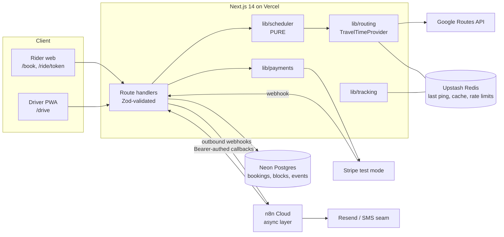
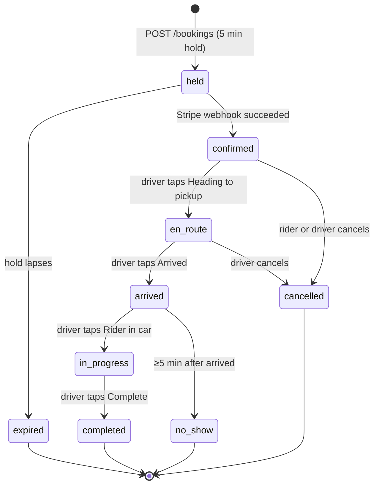

# ARCHITECTURE.md

## 1. Shape of the system

## 2. The split that matters: real-time vs async

| Concern | Path | Where | Why |
|---|---|---|---|
| Driver location ping → store | **Real-time** | Route handler → Redis | Sub-second, tiny payload |
| Rider ETA screen | **Real-time** | Poll 10 s → handler → Redis + routing cache | Must feel live |
| Slot search / feasibility | **Real-time** | Route handler → `lib/scheduler` | Interactive; owns correctness |
| Booking insert | **Real-time** | Transaction + advisory lock + re-run feasibility | Prevents double-booking |
| Confirmation email/SMS | **Async** | n8n | Retry, templating, no latency cost |
| T-30 reminder | **Async** | n8n schedule → app "due" endpoint → send → mark sent | Not latency-critical |
| Late-risk notice to rider | **Async** | App raises event → n8n sends | Human-facing copy, retries |
| Slack digest / HubSpot sync | **Async** | n8n | Optional, third-party |

**Rule:** n8n is never in the live path. The app never waits on n8n to answer a user.

## 3. Data model (Drizzle, Neon Postgres)

All timestamps `timestamptz` (UTC). Money is integer cents. Every table has `driver_id` so the engine is reusable.

**drivers**: `id`, `name`, `home_place jsonb`, `tz` (default `America/Chicago`), `avail_start_min` (300), `avail_end_min` (1440), `active`.

**bookings**
`id uuid`, `driver_id`, `token_hash` (magic-link token, hashed), `status` (enum below), `pickup_place jsonb`, `dropoff_place jsonb`, `pickup_at`, `planned_end_at`, `ride_minutes int`, `party_size int`, `price_cents int`, `price_tier text`, `policy_version text`, `payment_intent_id`, `payment_status`, `rider_name`, `rider_phone`, `rider_email`, `hold_expires_at`, `arrived_at`, `started_at`, `completed_at`, `cancelled_at`, `cancel_by` (`rider|driver`), `refund_cents`, `created_at`.

**blocks**: `id`, `driver_id`, `start_at`, `end_at`, `place jsonb`, `label`.

**driver_events** (audit): `id`, `driver_id`, `booking_id?`, `type`, `at`, `payload jsonb`.

**notifications**: `id`, `booking_id`, `channel`, `template`, `status`, `idempotency_key unique`, `created_at`. Guarantees "send once" across retries.

**Redis keys**

| Key | Value | TTL |
|---|---|---|
| `driver:{id}:loc` | `{lat,lng,accuracy,heading,at}` | 120 s |
| `route:{cellA}:{cellB}:{hourBucket}` | minutes | 6 h |
| `eta:{bookingId}:{pingAt}` | computed ETA | 60 s |
| `rl:{ip}:{route}` | counters | window |

**PII stance:** store the minimum (name, phone, email). Delete contact fields N days after completion (config; default 90, assumed). Precise location is transient (Redis TTL), never in Postgres.

## 4. Booking state machine

**Rider-visible phase is derived, not stored:** `countdown | live | in_progress | done`, computed by `visibilityWindow(pickupAt, now, status)`.

## 5. API surface

| Method + path | Auth | Purpose |
|---|---|---|
| `POST /api/slots` | public, rate-limited | Pickup, drop-off, date, party size → feasible slots + locked quote |
| `POST /api/bookings` | public, rate-limited | Re-runs feasibility **inside a transaction with an advisory lock**, creates a `held` booking + PaymentIntent |
| `POST /api/stripe/webhook` | Stripe signature | `held → confirmed`, refunds |
| `GET /api/rides/[token]` | signed token | Status + countdown; **location/ETA only inside T-30**, else `403 not_yet_visible` |
| `POST /api/rides/[token]/cancel` | signed token | Applies policy engine, refunds |
| `POST /api/driver/ping` | driver session | `{lat,lng,accuracy}` → Redis; triggers late-risk projection |
| `POST /api/driver/status` | driver session | State machine transition + ping |
| `GET /api/driver/day?date=` | driver session | Timeline with gaps and projections |
| `POST /api/driver/blocks` | driver session | Add/remove time blocks |
| `PUT /api/driver/availability` | driver session | Change day window |
| `GET /api/n8n/due` | `Authorization: Bearer` | Reminders and notices due now |
| `POST /api/n8n/ack` | `Authorization: Bearer` | n8n marks a notification sent (idempotent) |

## 6. Concurrency and holds

1. `POST /bookings` opens a transaction and takes `pg_advisory_xact_lock(hash(driver_id, local_date))`.
2. Loads the day's schedule (confirmed + unexpired `held`), re-runs `canInsert` on the exact pickup time.
3. If ok: insert `held` with `hold_expires_at = now + 5 min`; create the PaymentIntent. Else return `409 slot_taken` with fresh alternatives.
4. Expired holds are ignored by the schedule query (`hold_expires_at > now`) and reaped by a scheduled job.

## 7. Tracking and ETA

- Driver PWA: `watchPosition` while open (throttled 15–30 s) + a ping on each status tap. iOS cannot track in the background; the UI shows **"last seen N s ago"** so nothing pretends to be live when it isn't.
- Rider poll → handler checks `visibilityWindow`. Outside T-30: countdown only. Inside: read Redis ping; ETA = `provider.minutes(ping, pickup, now)` via the routing cache; if ping older than 90 s, flag stale.
- Privacy: a rider only ever sees their own pickup and the driver's location inside their window. No other rider data crosses the API.

## 8. Demo-mode matrix (env check → fallback)

| Integration | Env var(s) | If missing (demo) |
|---|---|---|
| Routing | `GOOGLE_MAPS_API_KEY` | `lib/routing/demo.ts` model + fixture matrix, UI chip: "Demo travel times" |
| Places | `NEXT_PUBLIC_GOOGLE_PLACES_KEY` | Fixed list of fake DFW places |
| Stripe | `STRIPE_SECRET_KEY`, `STRIPE_WEBHOOK_SECRET` | Simulated payment success/refund, chip: "Test payment (simulated)" |
| Postgres | `DATABASE_URL` | In-memory store seeded from fixtures |
| Redis | `UPSTASH_REDIS_REST_URL/TOKEN` | In-memory Map with TTL |
| Email | `RESEND_API_KEY` | Log to console + dev inbox page |
| SMS | `TWILIO_*` | Log-only, chip: "SMS not connected" |
| n8n | `N8N_WEBHOOK_BASE`, `N8N_BEARER` | Log-only outbox page at `/dev/outbox` |
| Auth | `AUTH_SECRET`, `DRIVER_EMAIL` | Dev-only "Sign in as driver" button (disabled in production) |

Remember gotcha #2: read `NEXT_PUBLIC_*` directly inside the function body.

## 9. Security checklist

- Zod on every handler; typed error responses.
- Rate limit public routes with Upstash (per IP + per route).
- Magic-link tokens: 32 bytes random, store **hash** only, constant-time compare, expire N days after ride.
- Stripe webhook: verify signature; idempotent on event id.
- n8n endpoints: Bearer secret; separate secret per environment; rotate on demo recording.
- Driver routes: Auth.js v5 session + email allowlist.
- No secrets in logs; scrub phone/email in Sentry.
- CORS closed by default.

## 10. Observability

Vercel Analytics for web vitals, Sentry for errors, PostHog for funnel (slot viewed → held → paid → completed). Log every `canInsert` rejection with its `reason`; those logs become lesson material and tuning data.

## 11. Deployment

Vercel project `blaqtaxxi`, preview per PR, subdomain `blaqtaxxi.elwoodberry.com`. Env vars per environment (Preview uses Stripe test + demo n8n). **Never** set `output: 'export'`.
