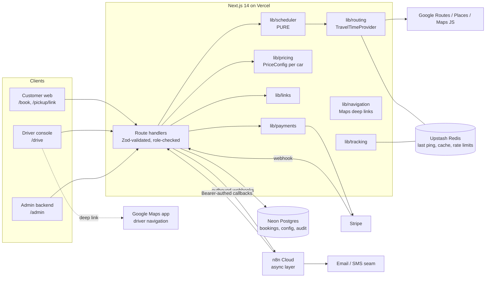
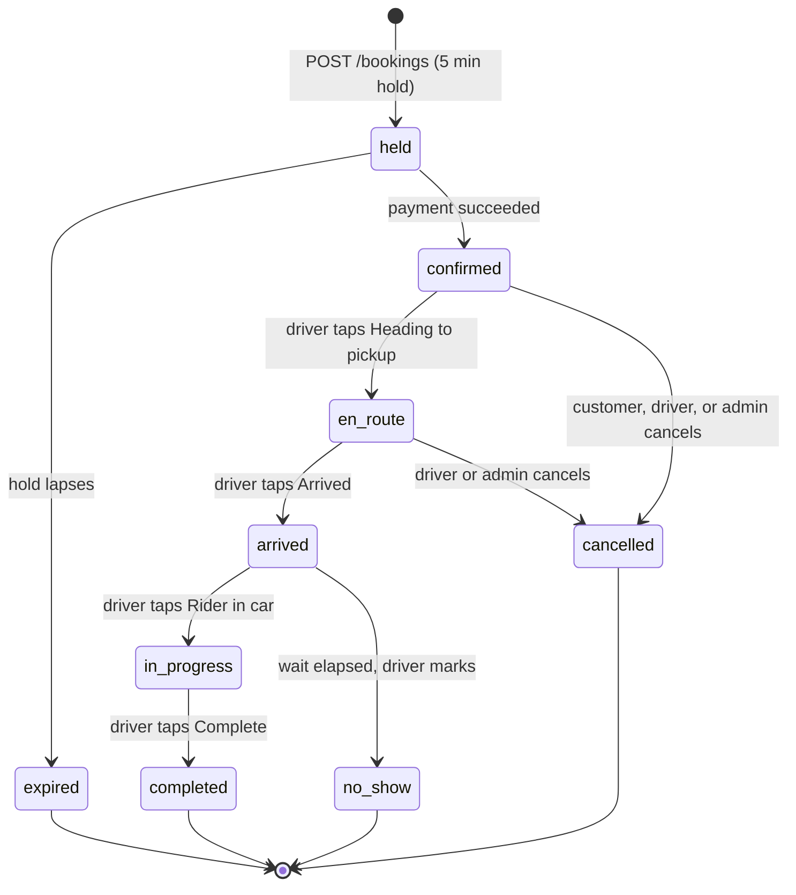

# ARCHITECTURE.md

## 1. Shape of the system

## 2. The split that matters: real-time vs async

| Concern | Path | Where | Why |
|---|---|---|---|
| Driver location ping → store | **Real-time** | Route handler → Redis | Tiny payload, low latency |
| Customer trip page (ETA, map) | **Real-time** | Poll 10 s → handler → Redis + routing cache | Must feel live |
| Slot search / feasibility | **Real-time** | Route handler → `lib/scheduler` | Interactive; owns correctness |
| Booking insert | **Real-time** | Transaction + advisory lock + re-run feasibility | Prevents double-booking |
| Admin config writes | **Real-time** | Route handler → DB + audit log | Immediate, authorized |
| Confirmation, link delivery, reminders, late notices, receipts | **Async** | n8n | Retry, templating, no latency cost |
| Daily digest, optional CRM sync | **Async** | n8n | Third-party, optional |

**Rule:** n8n is never in the live path. The app never waits on n8n to answer a user.

## 3. Surfaces and routes

| Surface | Routes | Auth |
|---|---|---|
| Customer | `/book`, `/pickup/[link]` | None. `/pickup` is authorized by the link secret (§10) |
| Driver | `/drive` | Session, role `driver` |
| Admin | `/admin/*` | Session, role `admin`, 2FA/passkey before production |
| Dev only (`demo`/`staging`) | `/dev/sim`, `/dev/outbox`, `/spike` | Disabled in production |

## 4. Data model (Drizzle, Neon Postgres)

All timestamps `timestamptz` (UTC). Money is integer cents. Config tables are **versioned**; history is never rewritten.

**users**: `id`, `email`, `role` (`admin|driver`), auth credential refs (passkey/2FA), `active`.

**drivers**: `id`, `user_id`, `display_name`, `photo_url`, `contact_phone`, `home_place jsonb`, `tz` (`America/Chicago`), `default_start_min` (300), `default_end_min` (1440), `active`. One row today; every other table carries `driver_id` so the engine is reusable.

**availability_overrides**: `id`, `driver_id`, `local_date`, `start_min?`, `end_min?`, `closed bool`, `note?`. Unique (`driver_id`, `local_date`). `dayWindow` reads the override first, else the driver default. End = last time a ride may **start** (D-09).

**blocks**: `id`, `driver_id`, `start_at`, `end_at`, `place jsonb`, `label`.

**vehicles**: `id`, `driver_id`, `label`, `year?`, `make`, `model`, `color`, `plate`, `seats`, `photo_url?`, `active`, `price_config_id`. Photo and plate live here, never in the repo.

**vehicle_assignments**: `id`, `driver_id`, `vehicle_id`, `from_at`, `to_at?`. No overlapping windows per driver. Sets which car (and therefore which price config) applies; it does **not** affect feasibility (D-83).

**price_configs**: PK (`config_id`, `version`), `effective_from`, `currency`, `tiers jsonb` (array of `upToMinutes` or null, `cents`, `label`), `created_by`, `created_at`. A vehicle's current price = the latest version with `effective_from <= now`.

**policies**: PK (`policy_id`, `version`), `effective_from`, `amounts jsonb` (free-cancel window, inside-window fee, en-route fee, no-show wait, late-driver threshold).

**message_templates**: `key`, `version`, `channel`, `subject?`, `body`, `effective_from`.

**business_profile**: legal name, address, support phone/email, logo, receipt fields.

**bookings**
`id uuid`, `driver_id`, `vehicle_id`, `status` (below), `pickup_place jsonb`, `dropoff_place jsonb`, `pickup_at`, `planned_end_at`, `ride_minutes`, `party_size`, `price_cents`, `price_config_id`, `price_config_version`, `policy_id`, `policy_version`, `route_polyline?`, `customer_name`, `customer_last_name_slug`, `customer_phone`, `customer_email`, `link_prefix`, `link_token_hash`, `link_expires_at`, `payment_intent_id`, `payment_status`, `hold_expires_at`, `arrived_at`, `started_at`, `completed_at`, `cancelled_at`, `cancel_by` (`customer|driver|admin`), `refund_cents`, `fee_cents`, `rating?` (1–5), `created_at`.

**notifications**: `id`, `booking_id`, `channel`, `template_key`, `template_version`, `status`, `idempotency_key unique`, `created_at`.

**config_audit_log** (append-only): `id`, `actor_user_id`, `entity`, `entity_id`, `before jsonb`, `after jsonb`, `at`.

**Redis keys**

| Key | Value | TTL |
|---|---|---|
| `driver:{id}:loc` | `{lat,lng,accuracy,heading,at}` | 120 s |
| `route:{cellA}:{cellB}:{hourBucket}` | minutes | 6 h |
| `eta:{bookingId}:{pingAt}` | computed ETA | 60 s |
| `rl:{ip}:{route}` and `rl:link:{ip}` | counters | window |

**PII stance:** minimum data (name, phone, email). Contact fields deleted 90 days after the trip (default, U-C4). Precise location is transient (Redis TTL), never in Postgres. The planned route polyline is stored per booking for the trip log (no live trail).

## 5. Booking state machine

**Customer-visible phase is derived, not stored:** `before | approaching | in_trip | after`, computed by `visibilityWindow(pickupAt, now, status)`, plus `cancelled | no_show | expired`.

## 6. API surface

| Method + path | Auth | Purpose |
|---|---|---|
| `POST /api/slots` | public, rate-limited | Pickup, drop-off, date, party size → feasible slots + locked quote for the assigned car |
| `POST /api/bookings` | public, rate-limited | Advisory-locked transaction, re-runs feasibility, creates a `held` booking + PaymentIntent, snapshots price and policy versions |
| `POST /api/stripe/webhook` | Stripe signature | `held → confirmed`, refunds, idempotent on event id |
| `GET /api/pickup/[link]` | link secret, rate-limited | Phase-appropriate payload. Location/ETA only inside T-30, else `403 not_yet_visible`. Never returns another customer's data |
| `POST /api/pickup/[link]/cancel` | link secret | Applies policy, shows fee, refunds |
| `POST /api/pickup/[link]/rating` | link secret | Optional private 1–5 rating after completion |
| `POST /api/pickup/recover` and `/verify` | public, strictly rate-limited | "Find my ride": last name + last 4 → one-time code |
| `POST /api/driver/ping` | driver session | `{lat,lng,accuracy}` → Redis; triggers late-risk projection |
| `POST /api/driver/status` | driver session | State transition + ping |
| `GET /api/driver/day?date=` | driver session | Timeline, gaps, projections, next pickup |
| `/api/admin/{availability,blocks,vehicles,price-configs,policies,operations,templates,profile,bookings,audit}` | admin session | CRUD with server-side role check, optimistic concurrency, audit log. Conflicts (bookings past a new cutoff) come back as warnings, never auto-cancelled |
| `GET /api/n8n/due`, `POST /api/n8n/ack` | `Authorization: Bearer` | Reminders and notices due now; idempotent ack |

Navigation deep links are built by `lib/navigation` from stored coordinates:
`https://www.google.com/maps/dir/?api=1&destination=<lat>,<lng>&travelmode=driving&dir_action=navigate` (format and no-key behavior verified against Google's Maps URLs documentation).

## 7. Concurrency and holds

1. `POST /bookings` opens a transaction and takes `pg_advisory_xact_lock(hash(driver_id, local_date))`.
2. Loads the day's schedule (confirmed + unexpired `held`) and re-runs `canInsert` on the exact pickup time.
3. If ok: insert `held` with `hold_expires_at = now + 5 min`, create the PaymentIntent, snapshot the current price config and policy versions. Else `409 slot_taken` with fresh alternatives.
4. Expired holds are ignored by the schedule query and reaped by a scheduled job.

## 8. Tracking, navigation, and ETA (with the open risk)

- **Verified:** Google's Navigation SDK is available for Android and iOS (and Flutter/React Native), **not web**, so a PWA cannot embed Google turn-by-turn. Google Maps URLs need no API key and `dir_action=navigate` starts turn-by-turn on mobile.
- **Not verified (spike SP-1, U-D1):** when the driver taps through to the Google Maps app, our PWA goes to the background. My understanding is that browsers stop delivering location to a backgrounded web page, which would freeze the customer's live map during the drive. Two outcomes:
  - *PWA is enough* (the test shows continuous pings): foreground `watchPosition` throttled 15–30 s plus a ping on every status tap.
  - *PWA is not enough:* a thin native shell for `/drive` only, with a background-location plugin, still loading the Next.js driver UI and deep-linking to Google Maps. This changes distribution (app store or ad hoc install) and must be approved before it is built.
- **Customer polling:** every 60 s before T-30, every 10 s inside the window. The server checks `visibilityWindow` on every request.
- **ETA:** approaching = `provider.minutes(lastPing, pickup, now)`; in trip = `provider.minutes(lastPing, dropoff, now)`. Cached per `(bookingId, pingAt)`. A ping older than 90 s is shown as "last seen N s ago", never as live.
- **Route on the map:** the planned route polyline is fetched once at trip start and stored on the booking; the car marker moves along it from pings.
- **Privacy:** a customer sees only their own booking and, inside their window, the driver's location.

## 9. Environments and the demo-mode matrix

`APP_ENV` = `demo | staging | production`. **Demo fallbacks run only in `demo`** (and selectively in `staging`). Production checks every required integration at boot and refuses to start if one is missing.

| Integration | Env var(s) | Missing on `demo` | Missing on `production` |
|---|---|---|---|
| Routing | `GOOGLE_MAPS_SERVER_KEY` | Demo model + fixture matrix, labeled "illustrative" | **Fail boot** |
| Maps in browser + Places | `NEXT_PUBLIC_GOOGLE_MAPS_BROWSER_KEY` | Static labeled map, fixed fake places | **Fail boot** |
| Stripe | `STRIPE_SECRET_KEY`, `STRIPE_WEBHOOK_SECRET`, publishable key | Simulated payment/refund | **Fail boot** (live keys only in production) |
| Postgres | `DATABASE_URL` | In-memory store from fixtures | **Fail boot** |
| Redis | `UPSTASH_REDIS_REST_URL/TOKEN` | In-memory Map with TTL | **Fail boot** |
| Email | `RESEND_API_KEY` | Log to `/dev/outbox` | **Fail boot** |
| SMS | `TWILIO_*` | Log-only | May be off only if U-N1 says email-first; customers are told where the link was sent |
| n8n | `N8N_WEBHOOK_BASE`, `N8N_BEARER` | Log-only outbox | **Fail boot** |
| Auth | `AUTH_SECRET`, admin allow-list | Dev-only "sign in as driver/admin" | **Fail boot**; the dev sign-in must not exist in the production build |
| Chips | `NEXT_PUBLIC_SHOW_TODO_CHIPS` | `true` | Must be unset or `false`; CI checks the built output |

Remember gotcha 2: read `NEXT_PUBLIC_*` inside the function body.

## 10. Security checklist

- Zod on every handler; typed errors; server-side role checks on every admin route, never UI-only.
- **Customer link is a bearer secret** (gotcha 11): high-entropy suffix, hash at rest, constant-time compare, per-IP and per-prefix rate limits with lockout, expiry, no link in logs or analytics (scrub `/pickup/*` paths), `Referrer-Policy: no-referrer` on the page, `noindex`.
- Stripe: webhook signature verified; idempotent on event id; card data never touches our servers.
- n8n endpoints: Bearer secret, separate per environment, rotated after any recorded demo.
- Admin: Auth.js v5, allow-listed identity, 2FA/passkey, session timeout, rate-limited sign-in, audit log.
- Secrets scrubbed from logs; Sentry strips phone/email; CORS closed by default.
- Google keys: browser key referrer-restricted; server key never shipped to the client.

## 11. Observability and operations

Vercel Analytics, Sentry (errors, alerting to the owner), PostHog (funnel: slot viewed → held → paid → completed; no customer PII). Log every `canInsert` rejection with its `reason`. Backups: enable and **test a restore** on the production database before launch (verify the plan's retention). Budget alerts on Google Maps, Vercel, Neon, Upstash, and SMS. A runbook and handoff document are part of Phase 9.

## 12. Deployment

Vercel project(s) owned per U-C1. Preview per PR. `staging` for client review (Stripe test). `production` at `www.blaqtaxxi.com` after the Phase 9 gate. **Never** set `output: 'export'`.
